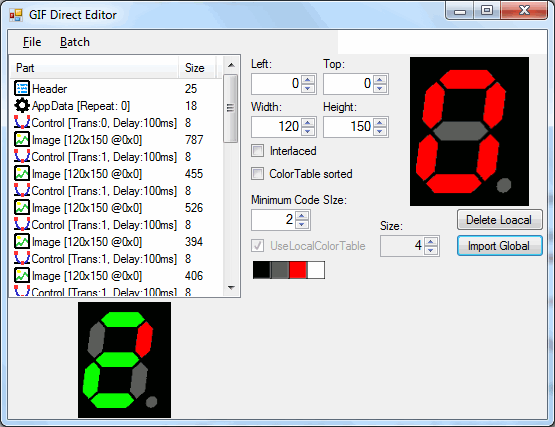

# GifWrapper
Editing GIF image meta data directly

This tool provides access to the meta data of GIF images. You can edit color tables, animation speeds and more. 

For detailed information see my CodeProject entry from this:

https://www.codeproject.com/Articles/1042433/Manipulating-GIF-Color-Tables

